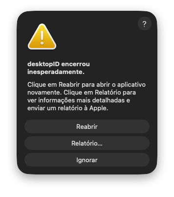
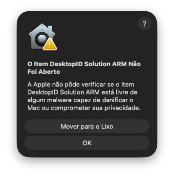

# DesktopIdSolutionARM
# 🛠️ DesktopID Solution ARM


**Correção para crash do `desktopID` no macOS Tahoe (Apple Silicon)**

---

## 📖 Visão Geral

O **DesktopID Solution ARM** é uma solução prática e eficiente para corrigir um erro crítico presente no macOS **Tahoe 26.3**, onde o aplicativo `desktopID` pode encerrar inesperadamente devido a falhas no sistema gráfico.

Este projeto é distribuído como um arquivo `.zip`, permitindo uso rápido e direto, sem necessidade de instalação complexa.

---

## 🧩 Problema

Usuários de Macs com Apple Silicon (especialmente M4) podem enfrentar:

- ❌ “desktopID encerrou inesperadamente”
- ❌ Travamentos recorrentes
- ❌ Instabilidade na interface gráfica

📌 Causa provável: incompatibilidade entre **Qt + OpenGL + macOS Tahoe (ARM)**
⚠️ Exemplo do alerta do macOS
Se o app tentar abrir e ocorrer erro, você verá algo assim:


### 🔍 Diagnóstico técnico

Os crash reports indicam:

- `EXC_BAD_ACCESS (SIGSEGV)`
- `KERN_INVALID_ADDRESS`
- Falhas em:
  - `QOpenGLContext::swapBuffers`
  - `NSOpenGLContext`
  - `CGLFlushDrawable`

**Stack trace típico:**
```
QOpenGLContext::swapBuffers
NSOpenGLContext flushBuffer
CGLFlushDrawable
```

📌 Causa provável: incompatibilidade entre **Qt + OpenGL + macOS Tahoe (ARM)**

---

## 💡 Solução

O **DesktopID Solution ARM** resolve o problema ao forçar o uso de renderização via software, evitando o uso de OpenGL acelerado por hardware.

### 🔧 Ajustes aplicados

```bash
QT_QUICK_BACKEND=software
QT_OPENGL=software
```

✔️ Elimina crashes  
✔️ Estabiliza o aplicativo  
✔️ Não altera o app original  

---

## 📦 Instalação

1. Baixe o arquivo `.zip`
2. Extraia o conteúdo
3. Localize o arquivo:

```
DesktopID Solution ARM.sh
```

---

## ▶️ Como usar

1. Dê duplo clique no arquivo:

```
DesktopID Solution ARM.sh
```

2. Siga as instruções na tela  
3. Selecione o `desktopID.app` quando solicitado  

✔️ O aplicativo será iniciado automaticamente com as correções aplicadas

⚠️ Se o app não abrir

Se o macOS exibir a mensagem de erro e o app não abrir, você verá algo assim:



Para contornar este bloqueio, siga os passos:

1. Clique em OK para fechar o alerta
2. Vá em **Preferências do Sistema → Segurança e Privacidade → Aba Geral**
3. Na parte inferior, aparecerá a opção para permitir a execução do app/script. Clique em **Abrir Mesmo Assim**
4. Confirme para liberar a execução

Você verá algo como a imagem abaixo ao permitir a execução:


💡 Isso é um comportamento padrão do macOS para apps/scripts não assinados.  
O script é seguro e desenvolvido por **@JWCMOURA**.
---

## ⚙️ O que o script faz

- Abre seletor de aplicativo (Finder)
- Localiza o executável interno (`Contents/MacOS`)
- Aplica variáveis de ambiente seguras
- Verifica se o processo já está rodando
- Inicia o app em background
- Exibe notificações do sistema

---

## 🚀 Funcionalidades

- ✅ Corrige erro `EXC_BAD_ACCESS`
- ✅ Evita falhas de OpenGL / Qt
- ✅ Execução simples (duplo clique)
- ✅ Compatível com Apple Silicon (M1, M2, M3, M4)
- ✅ Não requer instalação
- ✅ Seguro e não invasivo

---

## 💻 Requisitos

| Requisito | Detalhe |
|----------|--------|
| Sistema | macOS Tahoe 26.x |
| Arquitetura | Apple Silicon (ARM64) |
| Necessário | `desktopID.app` instalado |

---

## 🔒 Segurança

- Nenhuma modificação no sistema
- Nenhuma alteração no app original
- Execução isolada via script

---

## 👨‍💻 Autor

**William Moura**

- 🌐 https://linktr.ee/jwcmoura  
- 👨🏻‍💻 Instagram: @JWCMOURA  

---

## 📄 Licença

MIT License

---

## 📢 Aviso

Este projeto **não é afiliado à Apple**.  
Trata-se de uma solução independente para contornar um problema específico do macOS Tahoe. 

---
